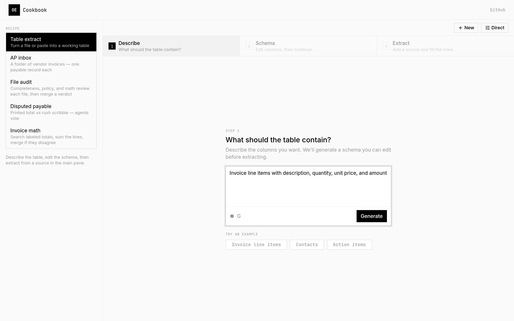
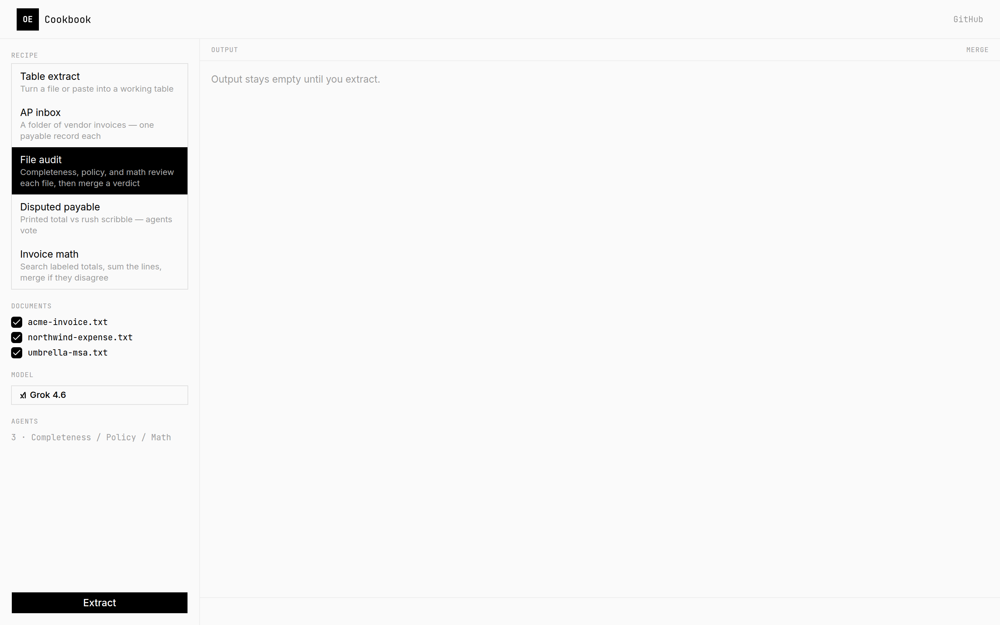

# openextract

**Extract structured data from documents, images, audio, and video using LLMs.**

[Documentation](https://mellow-artificial-intelligence.github.io/openextract/) · [Vision](VISION.md) · [Agents](AGENTS.md) · [Changelog](CHANGELOG.md) · [Issues](https://github.com/Mellow-Artificial-Intelligence/openextract/issues)

`openextract` turns any document, image, audio, or video file into a typed Zod object in a single call. Point it at a local path or a URL, pass a schema, and get back validated data. Model calls go through the [Vercel AI SDK](https://ai-sdk.dev) and [AI Gateway](https://vercel.com/ai-gateway).



## Installation

```bash
npm install openextract zod
```

For Claude Code or Codex extraction, also install the optional peer:

```bash
npm install @vercel/sandbox
```

Requires Node.js 20+. Set `AI_GATEWAY_API_KEY` (or deploy on Vercel with OIDC).

## Quick start

```ts
import { z } from "zod";
import { extract } from "openextract";

const PdfInfo = z.object({
  summary: z.string(),
  language: z.string(),
});

const result = await extract(PdfInfo, "xai/grok-4.6", "https://example.com/document.pdf", {
  instructions: "Return a two-sentence summary and the document's primary language.",
});

console.log(result.summary, result.language);
```

`result` is a validated `{ summary, language }` object — not a raw string.

Pydantic-AI style ids such as `openai:gpt-5.5` are accepted and routed to AI Gateway (`openai/gpt-5.5`).

## Extraction styles

`style` selects how the model inspects the input. The default, `direct`, sends the resolved media in one shot. For **text** documents you can search with file tools or run JavaScript against the text.

```ts
import { extract, ExtractionStyle } from "openextract";

await extract(PdfInfo, "openai/gpt-5.5", "notes.txt");

await extract(PdfInfo, "openai/gpt-5.5", "notes.txt", { style: "search" });
await extract(PdfInfo, "openai/gpt-5.5", "notes.txt", { style: ExtractionStyle.CODE });
```

`search` and `code` require UTF-8 text (`text/*`, JSON, XML, YAML, and similar). PDFs, Office documents, images, audio, and video stay on `direct`, or use `sandbox` with Claude Code or Codex.

```ts
await extract(PdfInfo, "claude-code", "./reports/q4.pdf");
await extract(PdfInfo, "codex", "./reports/q4.pdf");
```

`claude-code` and `codex` run inside a Vercel Sandbox (`style: "sandbox"` is selected automatically). Install optional peer `@vercel/sandbox`. Set `AI_GATEWAY_API_KEY`, and for local runs `VERCEL_TOKEN`, `VERCEL_TEAM_ID`, and `VERCEL_PROJECT_ID`. Optionally pin a pre-warmed image with `OPENEXTRACT_SANDBOX_SNAPSHOT_ID`. Nested models work as `claude-code/anthropic/claude-sonnet-4.6` or `codex/openai/gpt-5.6`.

## Reusable sessions

```ts
import { Extractor, RetryPolicy } from "openextract";

const extractor = new Extractor(PdfInfo, "openai/gpt-5.5", {
  instructions: "Extract the summary and primary language.",
  timeout: 30,
  retryPolicy: new RetryPolicy({ maxRetries: 3 }),
});

const first = await extractor.extract("./reports/q3.pdf");
const { output, usage } = await extractor.extractWithUsage("./reports/q4.pdf");
extractor.close();
```

## Inputs

Local paths, `http(s)` URLs, `Uint8Array` / `Buffer`, and readable streams are accepted. Bytes and streams require `mediaType`.

```ts
await extract(PdfInfo, "xai/grok-4.6", "./reports/q4.pdf");
await extract(PdfInfo, "xai/grok-4.6", pdfBytes, { mediaType: "application/pdf" });
```

Every input is capped at 50 MiB. Override with `maxInputBytes` or `OPENEXTRACT_MAX_INPUT_BYTES`. Oversized inputs raise `InputTooLargeError` before a model request.

## Retry and usage

```ts
const { output, usage } = await extractWithUsage(PdfInfo, "xai/grok-4.6", "./reports/q4.pdf", {
  maxRetries: 3,
});

console.log(usage.inputTokens, usage.outputTokens, usage.totalTokens);
```

Only transient `ModelError` failures (timeouts, rate limits, 5xx) are retried. Backoff is exponential with up to 25% jitter, bounded by `retryMaxBackoff` (60s). A provider `Retry-After` value takes precedence.

## Batch extraction

```ts
import { extractMany, extractManyWithResults, totalUsage } from "openextract";

const results = await extractMany(PdfInfo, "xai/grok-4.6", [
  "./reports/q3.pdf",
  { source: pdfBytes, mediaType: "application/pdf" },
]);

const rich = await extractManyWithResults(PdfInfo, "xai/grok-4.6", [
  "./reports/q3.pdf",
  "./reports/q4.pdf",
]);
console.log(totalUsage(rich.filter((item) => !(item instanceof Error))));
```

## Agent swarms

Run several agents on the same input in parallel, then reduce their outputs. `merge` (default) fills empty fields and unions unique array items. `vote` takes the majority value per field. `first` keeps the first successful agent.

```ts
import { extractSwarm, extractSwarmWithResults } from "openextract";

const merged = await extractSwarm(PdfInfo, "openai/gpt-5.5", "./reports/q4.pdf", {
  size: 4,
});

const { output, usage, agents } = await extractSwarmWithResults(PdfInfo, [
  { model: "openai/gpt-5.6-luna" },
  { model: "xai/grok-4.6", style: "search" },
  { model: "google/gemini-3.7-flash" },
], "./reports/q4.pdf", { reduce: "merge" });
```

The source is loaded once. Failed agents are skipped as long as one succeeds. In the web UI, set **Agents** and attach a model to each one. On the CLI, pass `--models openai/gpt-5.6-luna,xai/grok-4.6`.

A folder of AP invoices, a file-audit packet, and a disputed payable live in [`examples/cookbook`](examples/cookbook):

```bash
npm run cookbook
```

## Importable agents

Agents follow the eve authoring pattern: default-export `defineAgent` / `defineRemoteAgent`, no `name` field, `outputSchema` on the definition, and specialists under `subagents/`.

```text
agents/
├── agent.ts
├── instructions.md
└── subagents/
    ├── search/agent.ts
    └── remote.ts
```

```ts
import { defineAgent, extract, loadAgent } from "openextract";
import { Invoice } from "./schemas.js";

export default defineAgent({
  description: "Extracts invoice totals and line items.",
  model: "openai/gpt-5.5",
  style: "direct",
  outputSchema: Invoice,
});

const agent = await loadAgent("./agents");
const result = await extract(agent, "./bill.pdf");
```

```ts
import { defineRemoteAgent } from "openextract";
import { bearer } from "openextract/agents/auth";

export default defineRemoteAgent({
  url: () => process.env.OCR_AGENT_URL ?? "https://extract.example.com",
  description: "Remote OCR specialist.",
  auth: bearer(() => process.env.OCR_AGENT_TOKEN ?? ""),
  outputSchema: Invoice,
});
```

`description` is required. Identity comes from the path (or the import), not a `name` field. `loadAgent` accepts a directory (`agent.ts` + `subagents/` + optional `instructions.md`), a file default export, or `module:exportName`. Discovered subagents flatten into a swarm. `extract(schema, model, input)` still works; `extract(agent, input)` uses `outputSchema`.

A remote agent POSTs the already-loaded source to `{url}{path}` (default `/extract`) as JSON Schema plus base64 `data` / `mediaType`. The URL is trusted configuration (http/https only); it is not subject to document SSRF private-host blocking. Auth helpers: `bearer`, `basic`, `vercelOidc`.

```bash
npx openextract ./bill.pdf --agent ./agents
npx openextract ./bill.pdf --schema ./schemas.ts:Invoice --agents ./agents/subagents/search,./agents/subagents/remote.ts
```

## Terminal UI

```bash
npx openextract
npx openextract --tui ./reports/q4.pdf
```

The OpenTUI app takes a file, URL, or pasted text, a schema (presets, a field list, JSON, or `module:export`), and writes validated JSON. The native renderer needs [Bun](https://bun.sh) or Node.js 26.4+ with `--experimental-ffi`. If `bun` is on your `PATH`, `openextract` re-execs through it automatically.

Schema field lists look like this:

```
vendor: string
total: number
lineItems: [{ description: string, amount: number }]
```

Keys: `Tab` cycles fields, `Ctrl+E` extracts, `Ctrl+S` saves, `Ctrl+C` quits.

## Local web UI

```bash
cp web/.env.example web/.env.local
# set AI_GATEWAY_API_KEY
npm run web
```

The web UI has two tabs. **Extract** is a one-off table: describe columns, then run a team of specialists (gateway models and, optionally, Claude Code or Codex in a sandbox). Each coding agent has harness settings — especially which model it should use. **Agents** is a system builder: start from a named system or a blank roster, mix gateway models with coding agents, and extract against bundled fixtures.



On Vercel, set the Git root directory to `web/`. Production uses AI Gateway via OIDC; locally set `AI_GATEWAY_API_KEY`. Pull-request preview deploys are off.

## Command line

```bash
npx openextract ./reports/q4.pdf \
  --schema ./schemas.ts:Invoice \
  --model xai/grok-4.6 \
  --instructions "Pull totals and line items."
```

`--schema` is a `module:exportName` path to a Zod schema. `--agent` can be a directory, file, or `module:exportName`; omit `--schema` when the agent has `outputSchema`. Exit codes: `0` success, `2` URL fetch, `3` schema validation, `4` model, `5` other extraction, `6` missing credentials, `7` partial batch (`--continue-on-error`).

## MCP

```bash
npx openextract-mcp
```

stdio by default (Cursor, Claude Desktop). `--http --port 3000` serves Streamable HTTP on `127.0.0.1`.

```json
{
  "mcpServers": {
    "openextract": {
      "command": "npx",
      "args": ["openextract-mcp"],
      "env": {
        "AI_GATEWAY_API_KEY": "…",
        "OPENEXTRACT_MODEL": "openai/gpt-5.5"
      }
    }
  }
}
```

Tools cover the full API: `extract`, `extract_many`, `extract_swarm`, and reusable `create_extractor` / `extractor_extract` / `close_extractor` sessions. Pass a JSON Schema (or `module:exportName`) plus a path, URL, or base64 bytes. Importable agents use `agent` / `agents` as a directory, file, or `module:exportName`. Styles (`direct`, `search`, `code`, `sandbox`), retries, usage, batch, and swarm options are all available.

```ts
import { createOpenExtractMcpServer } from "openextract/mcp";
```

## Vercel Workflows

Run extraction agents as durable workflows. Each document is a retryable step, so long `search` / `code` tool loops survive crashes and deploys. Zod schemas are not serializable — pass JSON Schema (or a JSON Schema string).

```ts
import { start } from "workflow/api";
import { extractWorkflow } from "openextract/workflow";

const run = await start(extractWorkflow, [
  {
    schema: {
      type: "object",
      properties: { summary: { type: "string" }, language: { type: "string" } },
      required: ["summary", "language"],
    },
    model: "openai/gpt-5.5",
    input: { source: "https://example.com/document.pdf" },
    style: "direct",
  },
]);

const { output, usage } = await run.returnValue;
```

`extractManyWorkflow` runs each input as its own step. In Next.js, wrap the config with `withWorkflow()` from `workflow/next` and set `transpilePackages: ["openextract"]` so the `"use workflow"` / `"use step"` directives compile. See `examples/workflow/extract-route.ts`. The local web UI (`npm run web`) starts table extraction through the same runtime from the Extract tab.

## Error handling

```ts
import {
  extract,
  InputTooLargeError,
  UrlFetchError,
  SchemaValidationError,
  ModelError,
  ProviderNotInstalledError,
  RemoteAgentError,
  ExtractionError,
} from "openextract";

try {
  await extract(PdfInfo, "xai/grok-4.6", url);
} catch (error) {
  if (error instanceof UrlFetchError) { /* fetch / SSRF */ }
  else if (error instanceof InputTooLargeError) { /* size cap */ }
  else if (error instanceof SchemaValidationError) { /* schema mismatch */ }
  else if (error instanceof ProviderNotInstalledError) { /* AI_GATEWAY_API_KEY */ }
  else if (error instanceof ModelError) {
    console.log(error.provider, error.statusCode, error.retryable, error.retryAfter);
  } else if (error instanceof RemoteAgentError) { /* remote defineRemoteAgent */ }
  else if (error instanceof ExtractionError) { /* fallback */ }
}
```

## Environment

| Variable | Default | Purpose |
| --- | --- | --- |
| `AI_GATEWAY_API_KEY` | — | AI Gateway authentication |
| `OPENEXTRACT_URL_TIMEOUT` | `30` | URL fetch timeout (seconds) |
| `OPENEXTRACT_MAX_REDIRECTS` | `10` | Maximum redirect hops |
| `OPENEXTRACT_ALLOW_PRIVATE_URLS` | unset | Set `1` / `true` / `yes` to allow private hosts |
| `OPENEXTRACT_MAX_INPUT_BYTES` | `52428800` | Per-input byte cap |
| `OPENEXTRACT_SANDBOX_TIMEOUT` | `300` | Claude Code / Codex sandbox lifetime (seconds) |
| `OPENEXTRACT_SANDBOX_SNAPSHOT_ID` | — | Optional Vercel Sandbox snapshot with the CLIs preinstalled |
| `VERCEL_TOKEN` / `VERCEL_TEAM_ID` / `VERCEL_PROJECT_ID` | — | Sandbox auth for local runs (OIDC on Vercel) |

## Development

```bash
npm install
npm test
npm run test:coverage
npm run typecheck
```

## License

[MIT](LICENSE) © Cole McIntosh
